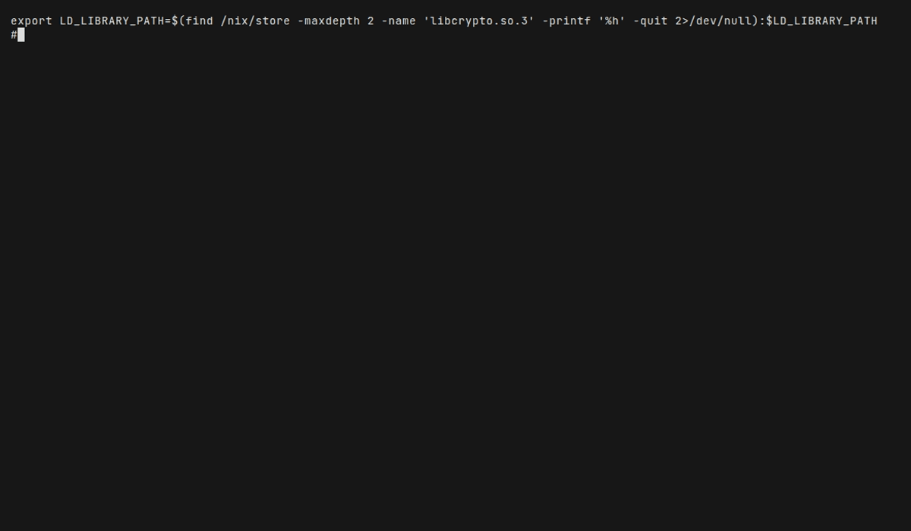
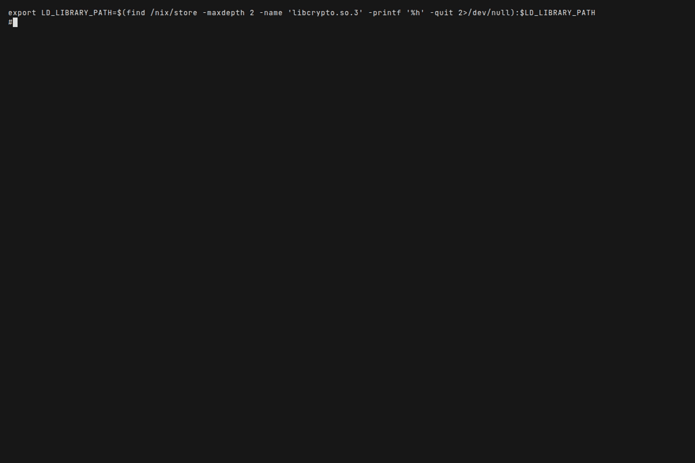

# CL-TRON-MCP

**AI-Powered Debugging for Common Lisp**

A Model Context Protocol (MCP) server that gives AI assistants deep access to running SBCL Common Lisp applications—debugger, inspector, profiler, and hot code reload.

## How It Works

### See It In Action

**Basic Debugging Demo:**


The AI connects to your running Lisp, triggers an error, inspects the backtrace, hot-reloads a fix, and verifies it works—all without restarting.

---

**Kilocode CLI Demo:**



Shows what you'd see when using Kilocode with Tron MCP: the terminal interface, commands, and output.

---

**Raw MCP Protocol:**



Shows the actual JSON-RPC messages that AI clients send to Tron internally. This is what Kilocode, Cursor, and Claude Code do under the hood.

---

### Architecture

```
┌─────────────────┐         ┌─────────────────┐         ┌─────────────────┐
│  SBCL + Swank   │◄───────►│   Tron (MCP)    │◄───────►│   AI Client     │
│  (Port 4006)    │         │   (stdio)       │         │ (Kilocode, etc) │
│                 │         │                 │         │                 │
│  Your code      │         │  86 tools:      │         │  Sends prompts  │
│  Debugger       │         │   - swank_eval  │         │  Receives       │
│  Threads        │         │   - inspect     │         │  results        │
│  State lives    │         │   - profile     │         │                 │
└─────────────────┘         └─────────────────┘         └─────────────────┘
        ▲
        │
        └──────────────────────────────────────────────────────┘
                      Same session, no restart
```

**Key insight:** All state lives in the SBCL process. Tron connects as a client. The session persists across debugging, hot-reloads, and errors.

📖 **[Full architecture documentation →](docs/architecture.md)**

## Features

| Category       | Description                                  | Documentation                                          |
| -------------- | -------------------------------------------- | ------------------------------------------------------ |
| **Debugger**   | Backtrace, restarts, stepping, breakpoints   | [docs/tools/debugger.md](docs/tools/debugger.md)       |
| **Inspector**  | Objects, slots, classes, functions, packages | [docs/tools/inspector.md](docs/tools/inspector.md)     |
| **Hot Reload** | Compile strings, reload systems              | [docs/tools/hot-reload.md](docs/tools/hot-reload.md)   |
| **Profiler**   | Start/stop profiling, generate reports       | [docs/tools/profiler.md](docs/tools/profiler.md)       |
| **Threads**    | List, inspect, get backtraces                | [docs/tools/threads.md](docs/tools/threads.md)         |
| **Monitor**    | Health checks, runtime stats, GC             | [docs/tools/monitor.md](docs/tools/monitor.md)         |
| **Swank**      | Slime/Portacle integration (21 tools)        | [docs/swank-integration.md](docs/swank-integration.md) |

**86 tools total** across 14 categories.

### Quick Tool Examples

**Debug an error:**

```lisp
(swank-eval :code "(my-buggy-function 7)")  ; triggers error
(swank-backtrace)                            ; see stack frames
(swank-invoke-restart :restart_index 2)      ; abort
(swank-eval :code "(defun my-buggy-function ...)")  ; hot-reload fix
```

**Profile performance:**

```lisp
(profile-start)
(swank-eval :code "(process-data)")
(profile-stop)
(profile-report :format "flat")
```

**Find callers:**

```lisp
(who-calls :symbol_name "my-package:process")
```

📖 **[More workflow examples →](prompts/workflow-examples.md)**

## Discoverable by AI Agents

The MCP is **fully discoverable**: an AI agent can learn how to use it without any user explanation.

- **Short path:** The agent calls **`prompts/get`** with name **`discover-mcp`**. That returns the exact steps: `resources/list` → `resources/read` AGENTS.md → `prompts/list` → `prompts/get` getting-started → `tools/list`. After that, the agent has everything needed to connect, evaluate, debug, inspect, profile, and hot-reload.
- **Read path:** The agent calls **`resources/list`**, then **`resources/read`** with uri **`AGENTS.md`**. That document (and the other listed resources) explains the one long-running Lisp session, connection, tools, workflows, and conventions.

No manual “how to use Tron” instructions are required. Standard MCP methods (`resources/list`, `resources/read`, `prompts/list`, `prompts/get`, `tools/list`) are enough.

📖 **[MCP resources and prompts →](docs/mcp-resources-prompts.md)**

## Quick Start

The server runs in **combined** mode by default (stdio + HTTP): both MCP-over-stdio and HTTP clients can connect. Use **`--stdio-only`** or **`--http-only`** to run one transport. Run `./start-mcp.sh --help` for options. HTTP port default is 4006. The process stays alive until you stop it (Ctrl+C). Clients send JSON-RPC via POST to `http://127.0.0.1:PORT/rpc`. Both transports use the same protocol: initialize returns MCP-compliant capabilities (e.g. `resources.subscribe` boolean); `prompts/get` returns messages with `content` as an array of parts per MCP spec. See [docs/starting-the-mcp.md](docs/starting-the-mcp.md) for details.

### 1. Start a Swank Server

```lisp
;; In SBCL
(ql:quickload :swank)
(swank:create-server :port 4006 :dont-close t)
```

### 2. Configure Your AI Client

You can run the MCP from a **local copy** or from a **clone of the GitHub repo**. In both cases the client runs a command that starts `start-mcp.sh` (or equivalent) inside the project directory.

#### Getting the server

| Option          | What to do                                                                                                                                                                                                                                      |
| --------------- | ----------------------------------------------------------------------------------------------------------------------------------------------------------------------------------------------------------------------------------------------- |
| **Local copy**  | You already have the repo on disk (e.g. in `~/quicklisp/local-projects/cl-tron-mcp`). Use that path in the config below.                                                                                                                        |
| **From GitHub** | Clone the repo, then use the path to the cloned directory: `git clone https://github.com/Alba-Intelligence/cl-tron-mcp.git` and `cd cl-tron-mcp`. In config, set the path to where you cloned it (e.g. `$HOME/cl-tron-mcp` or `~/cl-tron-mcp`). |

Replace **`/path/to/cl-tron-mcp`** in the examples below with your actual path (e.g. `~/cl-tron-mcp` or `$HOME/quicklisp/local-projects/cl-tron-mcp`). Copy the example for your client from **`examples/`** if you prefer. See [docs/starting-the-mcp.md](docs/starting-the-mcp.md) if the MCP won't start.

#### Kilocode

Config file: **`.kilocode/mcp.json`** (project) or global MCP settings. The repo provides **both** Tron variants under different server names so you can **choose one**:

| Server name           | Transport        | Choose this if…                          |
|-----------------------|------------------|------------------------------------------|
| **cl-tron-mcp-stdio** | STDIO            | You want Kilocode to start Tron (default)|
| **cl-tron-mcp-http**  | Streamable HTTP  | You run `./start-mcp.sh --http` yourself  |

Enable the one you want (`disabled: false`); leave the other disabled or remove it. See `examples/kilocode-mcp.json.example` for a template with both entries.

**STDIO (cl-tron-mcp-stdio, recommended):** `command` (path to `start-mcp.sh`) and `args: []`. Replace `/path/to/cl-tron-mcp` with your path.

**Streamable HTTP (cl-tron-mcp-http):** Start Tron with `./start-mcp.sh` (combined) or `./start-mcp.sh --http-only [--port 4006]`, then set `"type": "streamable-http"` and `"url": "http://127.0.0.1:4006/mcp"`.

#### OpenCode

Config file: **`~/.config/opencode/opencode.json`**.

```json
{
  "$schema": "https://opencode.ai/config.json",
  "mcp": {
    "cl-tron-mcp": {
      "type": "local",
      "command": ["bash", "-c", "cd /path/to/cl-tron-mcp && ./start-mcp.sh"],
      "enabled": true
    }
  }
}
```

#### Cursor

Config file: **`~/.cursor/mcp.json`** (or Cursor MCP settings).

```json
{
  "mcpServers": {
    "cl-tron-mcp": {
      "command": ["bash", "-c", "cd /path/to/cl-tron-mcp && ./start-mcp.sh"],
      "disabled": false,
      "env": {}
    }
  }
}
```

#### Other clients (Claude Code, VS Code, etc.)

Any MCP client that runs a **local command** can use Tron the same way:

1. Clone or copy the repo: `git clone https://github.com/Alba-Intelligence/cl-tron-mcp.git` (or use an existing local path).
2. In the client’s MCP config, add a server entry whose **command** runs the MCP over stdio, for example:
   - **Preferred:** `["/path/to/cl-tron-mcp/start-mcp.sh"]` or `["bash", "-c", "cd /path/to/cl-tron-mcp && ./start-mcp.sh"]`
   - **Alternative (SBCL only):** `["sbcl", "--non-interactive", "--noinform", "--eval", "(ql:quickload :cl-tron-mcp :silent t)", "--eval", "(cl-tron-mcp/core:start-server :transport :stdio-only)"]`

Ensure **SBCL** (or ECL) and **Quicklisp** are on the PATH when the client starts the server. To force ECL, use `["/path/to/cl-tron-mcp/start-mcp.sh", "--use-ecl"]`.

Example config files: [examples/cursor-mcp.json.example](examples/cursor-mcp.json.example), [examples/kilocode-mcp.json.example](examples/kilocode-mcp.json.example), [examples/opencode-mcp.json.example](examples/opencode-mcp.json.example).

### 3. Start Debugging

Ask your AI: _"Connect to Swank on port 4006 and debug factorial-example.lisp"_

## Installation

### Quicklisp

```lisp
(ql:quickload :cl-tron-mcp)
```

### From Source

```bash
git clone https://github.com/Alba-Intelligence/cl-tron-mcp.git
cd cl-tron-mcp
sbcl --eval '(load "cl-tron-mcp.asd")' --eval '(ql:quickload :cl-tron-mcp)'
```

## Development

### Running Tests

```lisp
(asdf:test-system :cl-tron-mcp)

;; Or with Rove
(ql:quickload :rove)
(rove:run :cl-tron-mcp/tests)
```

### Project Structure

```
cl-tron-mcp/
├── src/                    # Source code
│   ├── core/               # Core infrastructure
│   ├── swank/              # Swank client
│   ├── tools/              # Tool definitions
│   └── ...
├── tests/                  # Rove test suites
├── scripts/                # run-http.sh, tutorial-run.lisp, debug-mcp-stdio.sh
├── examples/               # MCP config examples, mcp-kilocode.json, example Python clients
├── docs/                   # Documentation
│   ├── architecture.md     # How it works
│   ├── DEVELOPERS.md       # Developer guide (where to add features)
│   ├── swank-integration.md
│   └── tools/              # Tool docs
├── prompts/                # Workflow guides
├── demo/                   # Demo generation
└── AGENTS.md              # AI agent guidelines
```

### Documentation

| Document                                                         | Purpose                                                      |
| ---------------------------------------------------------------- | ------------------------------------------------------------ |
| [AGENTS.md](AGENTS.md)                                           | Quick start for AI agents using Tron                         |
| [docs/architecture.md](docs/architecture.md)                     | System architecture and design                               |
| [docs/swank-integration.md](docs/swank-integration.md)           | Swank protocol details                                       |
| [docs/mcp-resources-prompts.md](docs/mcp-resources-prompts.md)   | MCP discoverability features                                 |
| [docs/starting-the-mcp.md](docs/starting-the-mcp.md)             | Starting the MCP and troubleshooting                         |
| [docs/demo-creation.md](docs/demo-creation.md)                   | How to create demo GIFs                                      |
| [tutorial/e2e-mcp-workflow.md](tutorial/e2e-mcp-workflow.md)     | End-to-end workflow (connect, eval, error, restart, hot-fix) |
| [prompts/workflow-examples.md](prompts/workflow-examples.md)     | Step-by-step usage examples                                  |
| [prompts/debugging-workflows.md](prompts/debugging-workflows.md) | Debugging patterns                                           |

### Contributing

See [CONTRIBUTING.md](CONTRIBUTING.md) for setup, tests, and PR process, and [docs/DEVELOPERS.md](docs/DEVELOPERS.md) for where to add features and how the codebase is organized.

1. Fork the repository
2. Create a feature branch
3. Follow guidelines in [AGENTS.md](AGENTS.md)
4. Add tests
5. Submit a pull request

## Requirements

- **SBCL** 2.0.0 or later, or **ECL** (Embeddable Common Lisp). The MCP server runs with either. `start-mcp.sh` selects the Lisp by: **`--use-sbcl`** / **`--use-ecl`** (CLI) or auto-detect (sbcl, then ecl). Run **`./start-mcp.sh --help`** for full usage.
- **Quicklisp**
- **Swank** (for Slime/Portacle/Sly)

## Troubleshooting

| Problem                    | Solution                                         |
| -------------------------- | ------------------------------------------------ |
| "Package not found"        | `(ql:quickload :cl-tron-mcp)` first              |
| Client shows "failed"      | Use `start-mcp.sh` which handles stdio correctly |
| "Not connected to REPL"    | Run `swank_connect` or `repl_connect` first      |
| Tests fail with stale FASL | `(asdf:compile-system :cl-tron-mcp :force t)`    |

## License

Apache License 2.0. See [LICENSE](LICENSE) file.

## Resources

- **Repository:** [https://github.com/Alba-Intelligence/cl-tron-mcp](https://github.com/Alba-Intelligence/cl-tron-mcp)
- [SBCL Documentation](http://www.sbcl.org/)
- [Model Context Protocol](https://modelcontextprotocol.io/)
- [Swank/Slime](https://slime.common-lisp.dev/)
