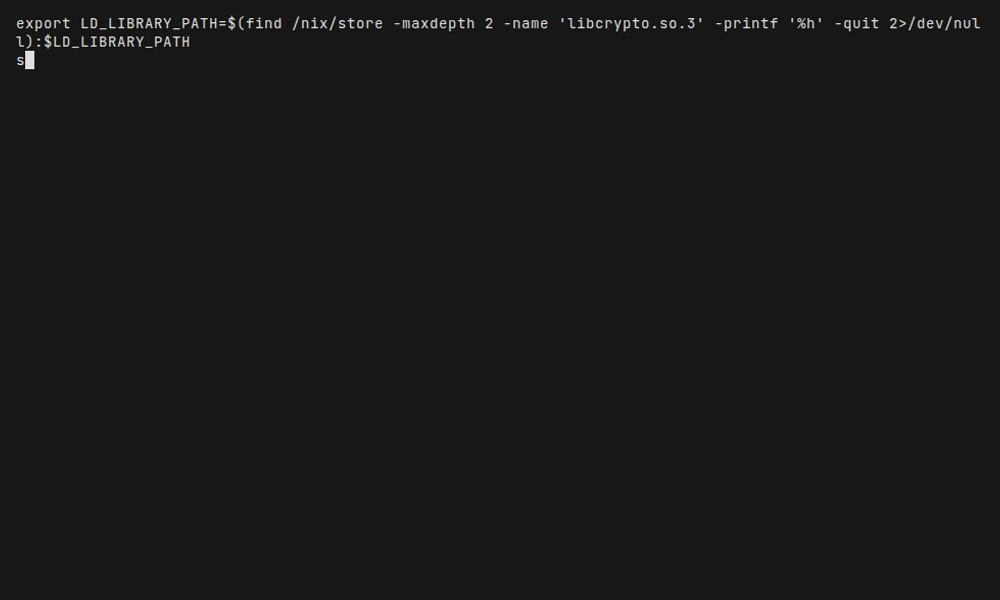
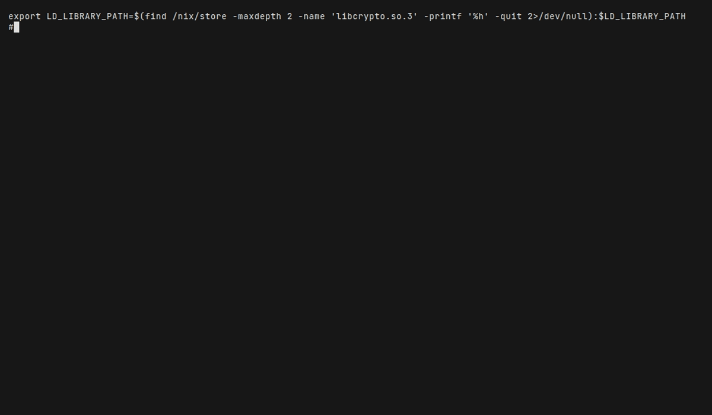
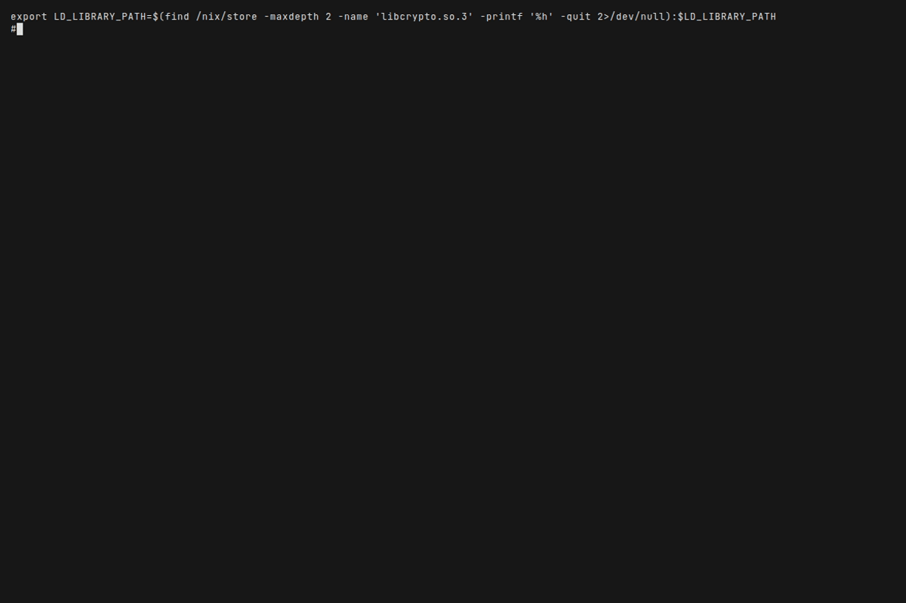

# Tron MCP Demos

Animated demos showing Tron's debugging, hot-reload, and MCP capabilities.

## Demos

### 1. Basic Debugging Demo (`demo-script.lisp`)

Launches Swank, defines a buggy `factorial`, triggers `DIVISION-BY-ZERO`, inspects the debugger state, hot-reloads the fix, and verifies.



```bash
sbcl --noinform --disable-debugger --load demo/demo-script.lisp
```

### 2. f1/f2 Hot-Reload Demo (`demo-f1-f2.lisp`)

The canonical hot-reload workflow: define two functions, trigger an error in `f2`, fix it live, and verify — all without restarting the Lisp image.


```bash
sbcl --noinform --disable-debugger --load demo/demo-f1-f2.lisp
```

### 3. Kilocode CLI Demo (`demo-kilocode.lisp`)

Simulates what a Kilocode AI agent sees when it uses Tron to debug and fix code.



```bash
sbcl --noinform --disable-debugger --load demo/demo-kilocode.lisp
```

### 4. Raw MCP Protocol Demo (`demo-mcp-raw.lisp`)

Shows the actual JSON-RPC messages that MCP clients (Cursor, VS Code, OpenCode) send to Tron internally.



```bash
sbcl --noinform --disable-debugger --load demo/demo-mcp-raw.lisp
```

## Re-recording GIFs

All GIFs are recorded with [VHS](https://github.com/charmbracelet/vhs). Each `.tape` file defines the terminal recording.

```bash
# Record all demos
./demo/generate.sh

# Record a single demo
vhs demo/demo-f1-f2.tape
```

### NixOS

On NixOS, `LD_LIBRARY_PATH` must include the OpenSSL library path. The tape files handle this automatically via a hidden setup step. If running demos manually, set:

```bash
export LD_LIBRARY_PATH=$(find /nix/store -maxdepth 2 -name 'libcrypto.so.3' -printf '%h' -quit 2>/dev/null):$LD_LIBRARY_PATH
```

## How It Works

Each demo is **self-contained**: it loads `cl-tron-mcp`, launches its own Swank server on port 14006, runs the demo workflow, then cleans up. No external Swank server needed.

## Files

| File | Purpose |
|------|---------|
| `demo-script.lisp` | Basic debugging demo script |
| `demo-f1-f2.lisp` | Hot-reload demo script |
| `demo-kilocode.lisp` | Kilocode CLI demo script |
| `demo-mcp-raw.lisp` | Raw MCP protocol demo script |
| `demo.tape` | VHS tape for basic demo |
| `demo-f1-f2.tape` | VHS tape for f1/f2 demo |
| `demo-kilocode.tape` | VHS tape for Kilocode demo |
| `demo-mcp-raw.tape` | VHS tape for raw MCP demo |
| `generate.sh` | Script to re-record all GIFs |
